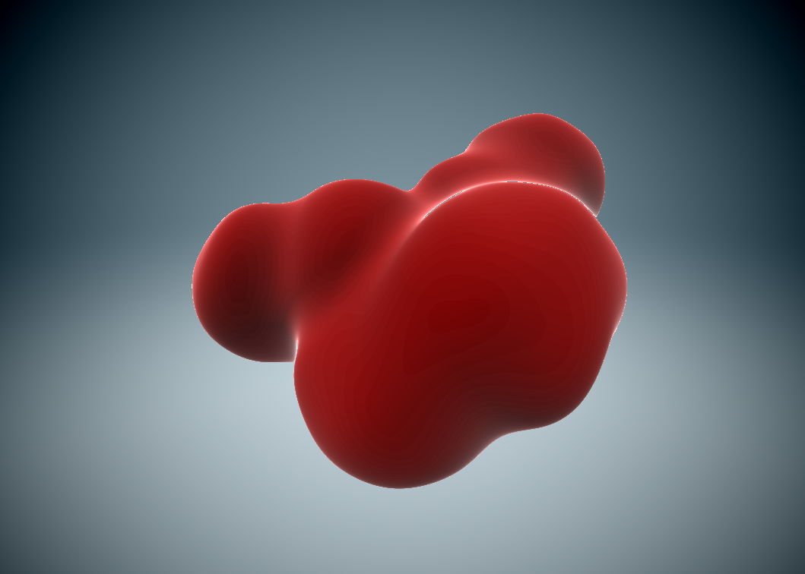

# WebGL metaballs

This is a WebGL experiment to play with metaballs visualisation.

Metaballs are organic-looking objects (usually spheres) that can blend together
when in close proximity to form a continuous surface, which appear blobby.

As opposed to the traditional way of rendering 3D objects (with triangle meshes
submitted to be rendered to the GPU with relatively straightforward vertex and fragment shaders,
using the GPU's optimised process to rasterize triangles),
metaballs surfaces are calculated on a pixel-by-pixel basis in the fragment shader,
using a technique called ray marching.



## Building

Install dependencies first (you need `node` and `npm` on your machine):
```bash
$ npm i
```
Then run the build and development server:
```bash
$ npm run watch
```
You can now see the metaballs experiment in your browser at http://localhost:8080/.

Click and drag / touch the screen to rotate around the blob of metaballs.
